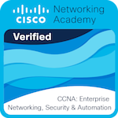
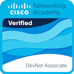
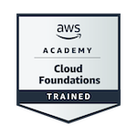
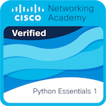

# Hi, I'm Adam
*Computer Science Student | Systems & Backend Enthusiast*

---

### Tech Stack
**Languages:**  
 

**Infrastructure & DB:**  

---

### Badges

    
    
    
    
    

---

### Featured Project
- [**Metabrowser**](https://github.com/bernolak-rs/metabrowser) - A high-performance browser built with Rust Actix-Web and PostgreSQL.
- [**ParkingLotSimulator**](https://github.com/bernolak-rs/Parking-lot-simulator-in-C-) - ParkingLot simulator App
- [**QT-Music**](https://github.com/bernolak-rs/qt_music) - QT Music Player
